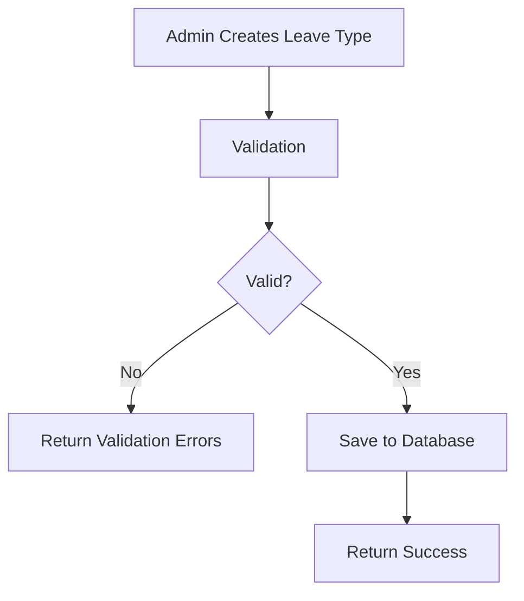
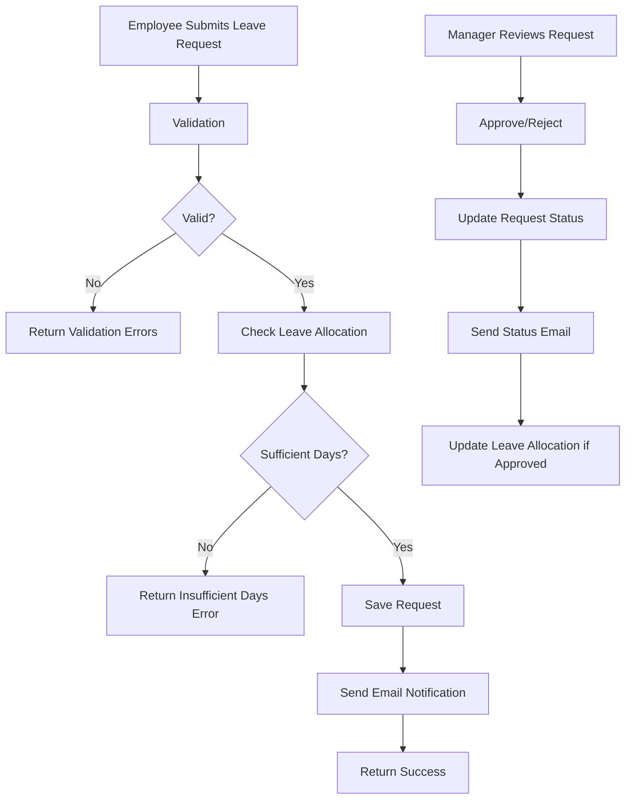
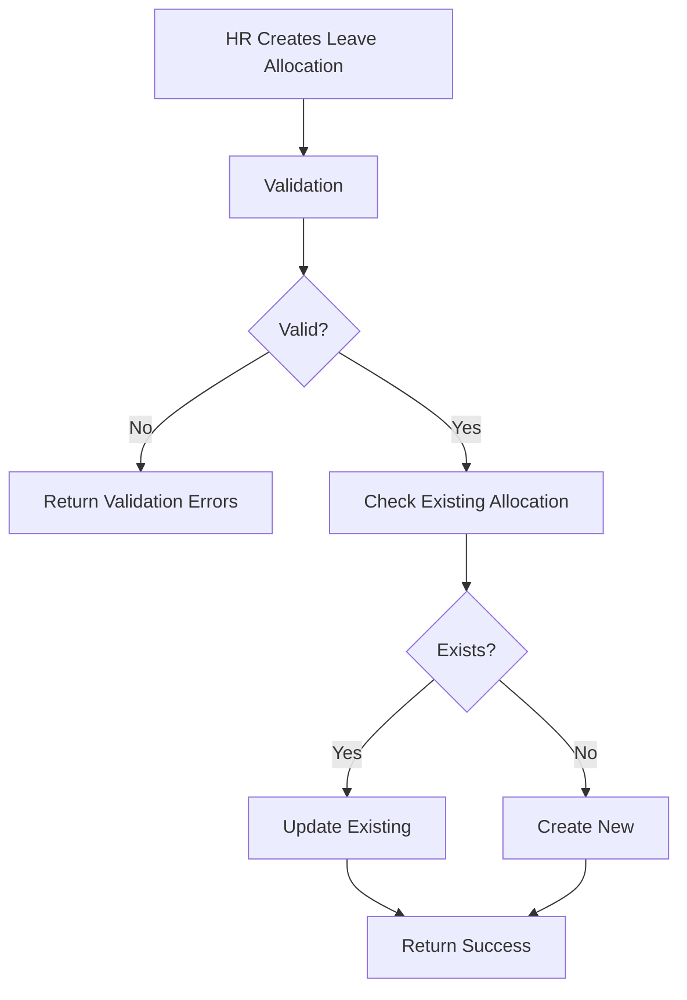

# HR Leave Management System - Comprehensive Documentation

## Table of Contents
1. [System Overview](#system-overview)
2. [Architecture](#architecture)
3. [Domain Model](#domain-model)
4. [Application Flow](#application-flow)
5. [Technical Implementation](#technical-implementation)
6. [API Documentation](#api-documentation)
7. [Data Flow Diagrams](#data-flow-diagrams)
8. [Development Guidelines](#development-guidelines)

## System Overview

The HR Leave Management System is a comprehensive enterprise application built using **Clean Architecture** principles with **.NET 9** and **Blazor WebAssembly**. The system manages employee leave requests, allocations, and types with automated approval workflows and email notifications.

### Key Features
- **Leave Type Management**: Define and manage different types of leaves (vacation, sick, personal, etc.)
- **Leave Allocation**: Allocate leave days to employees for specific periods
- **Leave Request Processing**: Submit, approve, reject, and cancel leave requests
- **Email Notifications**: Automated email notifications for leave request status changes
- **Clean Architecture**: Separation of concerns with clear layer boundaries
- **RESTful API**: Well-documented API with Swagger/OpenAPI support
- **Blazor UI**: Modern web-based user interface

### Technology Stack
- **.NET 9**: Latest .NET framework
- **Entity Framework Core**: Data access and ORM
- **MediatR**: CQRS and mediator pattern implementation
- **AutoMapper**: Object-to-object mapping
- **FluentValidation**: Validation framework
- **Blazor WebAssembly**: Frontend UI framework
- **SQL Server**: Database (configurable)
- **Swagger/OpenAPI**: API documentation

## Architecture

The system follows **Clean Architecture** principles with clear separation of concerns:

```
???????????????????????????????????????????????????????????????
?                    PRESENTATION LAYER                        ?
???????????????????????????????????????????????????????????????
?    Blazor WebAssembly   ?         Web API                   ?
?    HR.LeaveManagement   ?    HR.LeaveManagement.Api         ?
?    .BlazorUI            ?                                   ?
???????????????????????????????????????????????????????????????
                          ?
???????????????????????????????????????????????????????????????
?                    APPLICATION LAYER                        ?
???????????????????????????????????????????????????????????????
?           HR.LeaveManagement.Application                    ?
?  • Commands & Queries (CQRS)                               ?
?  • Handlers                                                 ?
?  • Validators                                               ?
?  • DTOs & Mapping                                           ?
?  • Contracts/Interfaces                                     ?
???????????????????????????????????????????????????????????????
                          ?
???????????????????????????????????????????????????????????????
?                      DOMAIN LAYER                           ?
???????????????????????????????????????????????????????????????
?              HR.LeaveManagement.Domain                      ?
?  • Entities (LeaveType, LeaveRequest, LeaveAllocation)      ?
?  • Base Entity (Common properties)                          ?
?  • Domain Logic                                             ?
???????????????????????????????????????????????????????????????
                          ?
???????????????????????????????????????????????????????????????
?                   INFRASTRUCTURE LAYER                      ?
???????????????????????????????????????????????????????????????
?     Persistence         ?        Infrastructure             ?
? HR.LeaveManagement      ?   HR.LeaveManagement             ?
? .Persistence            ?   .Infrastructure                ?
? • EF DbContext          ?   • Email Service                ?
? • Repositories          ?   • Logging                      ?
? • Configurations        ?   • External Services            ?
???????????????????????????????????????????????????????????????
```

## Domain Model

### Core Entities

#### 1. BaseEntity
```csharp
public abstract class BaseEntity
{
    public int Id { get; set; }
    public DateTime? DateCreated { get; set; }
    public DateTime? DateModified { get; set; }
}
```

#### 2. LeaveType
```csharp
public class LeaveType : BaseEntity
{
    public string Name { get; set; } = string.Empty;
    public int DefaultDays { get; set; }
}
```
**Purpose**: Defines types of leave (e.g., Vacation, Sick Leave, Personal Leave)

#### 3. LeaveRequest
```csharp
public class LeaveRequest : BaseEntity
{
    public DateTime StartDate { get; set; }
    public DateTime EndDate { get; set; }
    public LeaveType LeaveType { get; set; }
    public int LeaveTypeId { get; set; }
    public DateTime DateRequested { get; set; }
    public string? RequestComments { get; set; }
    public bool? Approved { get; set; }
    public bool? Cancelled { get; set; }
    public string RequestingEmployeeId { get; set; }
}
```
**Purpose**: Represents an employee's request for leave

#### 4. LeaveAllocation
```csharp
public class LeaveAllocation : BaseEntity
{
    public int NumberOfDays { get; set; }
    public LeaveType LeaveType { get; set; }
    public int LeaveTypeId { get; set; }
    public int Period { get; set; }
    public string EmployeeId { get; set; } = string.Empty;
}
```
**Purpose**: Represents allocated leave days for an employee for a specific period

### Entity Relationships
```
LeaveType (1) ???? (Many) LeaveRequest
LeaveType (1) ???? (Many) LeaveAllocation
Employee (1) ???? (Many) LeaveRequest
Employee (1) ???? (Many) LeaveAllocation
```

## Application Flow

### 1. Leave Type Management Flow


### 2. Leave Request Processing Flow


### 3. Leave Allocation Flow


## Technical Implementation

### CQRS Pattern Implementation

The application uses **CQRS (Command Query Responsibility Segregation)** pattern with **MediatR**:

#### Commands (Write Operations)
- `CreateLeaveTypeCommand`
- `UpdateLeaveTypeCommand`
- `DeleteLeaveTypeCommand`
- `CreateLeaveRequestCommand`
- `UpdateLeaveRequestCommand`
- `CancelLeaveRequestCommand`
- `ChangeLeaveRequestApprovalCommand`
- `CreateLeaveAllocationCommand`
- `UpdateLeaveAllocationCommand`

#### Queries (Read Operations)
- `GetLeaveTypesQuery`
- `GetLeaveTypesDetailsQuery`
- `GetLeaveRequestQuery`
- `GetLeaveRequestDetailQuery`
- `GetLeaveAllocationsQuery`
- `GetLeaveAllocationDetailsQuery`

### Repository Pattern

Generic repository pattern with specific implementations:

```csharp
public interface IGenericRepository<T> where T : BaseEntity
{
    Task<IReadOnlyList<T>> GetAsync();
    Task<T> GetByIdAsync(int id);
    Task CreateAsync(T entity);
    Task UpdateAsync(T entity);
    Task DeleteAsync(T entity);
}

public interface ILeaveTypeRepository : IGenericRepository<LeaveType>
{
    Task<bool> IsLeaveTypeUnique(string name);
}
```

### Validation Strategy

FluentValidation is used for input validation:

```csharp
public class CreateLeaveRequestCommandValidator : AbstractValidator<CreateLeaveRequestCommand>
{
    private readonly ILeaveTypeRepository _leaveTypeRepository;
    
    public CreateLeaveRequestCommandValidator(ILeaveTypeRepository leaveTypeRepository)
    {
        _leaveTypeRepository = leaveTypeRepository;
        
        RuleFor(p => p.StartDate)
            .NotEmpty()
            .GreaterThan(DateTime.Now);
            
        RuleFor(p => p.EndDate)
            .NotEmpty()
            .GreaterThan(p => p.StartDate);
    }
}
```

### Database Configuration

Entity Framework Core with automatic timestamp management:

```csharp
public override Task<int> SaveChangesAsync(bool acceptAllChangesOnSuccess, CancellationToken cancellationToken = default)
{
    var now = DateTime.Now;
    
    foreach (var entry in ChangeTracker.Entries<BaseEntity>().Where(q => q.State == EntityState.Added || q.State == EntityState.Modified))
    {
        entry.Entity.DateModified = now;
        if (entry.State == EntityState.Added)
        {
            entry.Entity.DateCreated = now;
        }
    }
    
    return base.SaveChangesAsync(acceptAllChangesOnSuccess, cancellationToken);
}
```

## API Documentation

### Base URL
```
https://localhost:7xxx/api
```

### Authentication
Currently configured for development without authentication. Production should implement appropriate authentication mechanisms.

### Endpoints

#### Leave Types
- `GET /api/leavetypes` - Get all leave types
- `GET /api/leavetypes/{id}` - Get leave type by ID
- `POST /api/leavetypes` - Create new leave type
- `PUT /api/leavetypes/{id}` - Update leave type
- `DELETE /api/leavetypes/{id}` - Delete leave type

#### Leave Requests
- `GET /api/leaverequest` - Get all leave requests
- `GET /api/leaverequest/{id}` - Get leave request by ID
- `POST /api/leaverequest` - Create new leave request
- `PUT /api/leaverequest/{id}` - Update leave request
- `DELETE /api/leaverequest/{id}` - Delete leave request
- `PUT /api/leaverequest/approval/{id}` - Approve/reject leave request
- `PUT /api/leaverequest/cancel/{id}` - Cancel leave request

#### Leave Allocations
- `GET /api/leaveallocation` - Get all leave allocations
- `GET /api/leaveallocation/{id}` - Get leave allocation by ID
- `POST /api/leaveallocation` - Create new leave allocation
- `PUT /api/leaveallocation/{id}` - Update leave allocation
- `DELETE /api/leaveallocation/{id}` - Delete leave allocation

### Sample API Requests

#### Create Leave Type
```json
POST /api/leavetypes
{
    "name": "Annual Leave",
    "defaultDays": 25
}
```

#### Create Leave Request
```json
POST /api/leaverequest
{
    "startDate": "2024-01-15T00:00:00Z",
    "endDate": "2024-01-20T00:00:00Z",
    "leaveTypeId": 1,
    "requestComments": "Family vacation"
}
```

## Data Flow Diagrams

### System Context Diagram
```
???????????????    HTTP/HTTPS    ???????????????????????
?   Employee  ? ????????????????? ?   Blazor WebApp     ?
???????????????                  ???????????????????????
                                           ?
???????????????    HTTP/HTTPS              ? HTTP API Calls
?   Manager   ? ???????????????????????????????????????????????
???????????????                            ?                 ?
                                           ?                 ?
???????????????    HTTP/HTTPS    ???????????????????????    ???????????????????????
? HR Admin    ? ????????????????? ?   Web API           ?    ?   External APIs     ?
???????????????                  ???????????????????????    ???????????????????????
                                           ?
                                           ?
                                 ???????????????????????
                                 ?   Database          ?
                                 ?   (SQL Server)      ?
                                 ???????????????????????
```

### Application Layer Data Flow
```
???????????????    Commands      ???????????????????????    Domain       ???????????????????????
? Controllers ? ????????????????? ?   Command Handlers  ? ??????????????? ?   Domain Entities   ?
???????????????                  ???????????????????????                ???????????????????????
       ?                                   ?                                       ?
       ? Queries                           ? Validation                            ?
       ?                                   ?                                       ?
???????????????????????          ???????????????????????                ???????????????????????
?   Query Handlers    ?          ?   Validators        ?                ?   Repository        ?
???????????????????????          ???????????????????????                ???????????????????????
       ?                                                                          ?
       ? Read Operations                                                          ? CRUD Operations
       ?                                                                          ?
???????????????????????                                                 ???????????????????????
?   DTOs              ?                                                 ?   Database          ?
???????????????????????                                                 ???????????????????????
```

## Development Guidelines

### Code Organization
1. **Domain Layer**: Contains only domain entities and business logic
2. **Application Layer**: Contains use cases, DTOs, validation, and interfaces
3. **Infrastructure Layer**: Contains external concerns (database, email, logging)
4. **Presentation Layer**: Contains UI and API controllers

### Naming Conventions
- **Commands**: `{Verb}{Entity}Command` (e.g., `CreateLeaveTypeCommand`)
- **Queries**: `Get{Entity}{Detail}Query` (e.g., `GetLeaveTypesQuery`)
- **Handlers**: `{Command/Query}Handler` (e.g., `CreateLeaveTypeCommandHandler`)
- **Validators**: `{Command}Validator` (e.g., `CreateLeaveTypeCommandValidator`)

### Error Handling
- Custom exceptions for different error types
- Global exception middleware for API
- Consistent error response format
- Validation errors returned with 400 status codes

### Testing Strategy
- Unit tests for business logic
- Integration tests for data access
- API tests for controller endpoints
- Test-driven development approach

### Security Considerations
1. **Authentication**: Implement JWT-based authentication
2. **Authorization**: Role-based access control
3. **Data Validation**: Server-side validation for all inputs
4. **SQL Injection**: Use parameterized queries (EF Core handles this)
5. **CORS**: Configure appropriate CORS policies for production

### Performance Optimizations
1. **Pagination**: Implement pagination for large data sets
2. **Caching**: Add caching for frequently accessed data
3. **Async Operations**: Use async/await throughout the application
4. **Database Indexing**: Add appropriate database indexes
5. **Connection Pooling**: Configure EF Core connection pooling

### Deployment Architecture
```
???????????????????????    Load Balancer    ???????????????????????
?   Blazor WebApp     ? ??????????????????? ?   Web API Instance  ?
?   (Static Files)    ?                     ?   (IIS/Kestrel)     ?
???????????????????????                     ???????????????????????
                                                     ?
                                                     ?
                                           ???????????????????????
                                           ?   SQL Server        ?
                                           ?   (Production DB)   ?
                                           ???????????????????????
```

### Future Enhancements
1. **Real-time Notifications**: SignalR for real-time updates
2. **Mobile App**: Xamarin or MAUI mobile application
3. **Reporting**: Advanced reporting and analytics
4. **Calendar Integration**: Outlook/Google Calendar integration
5. **Workflow Engine**: Custom approval workflow engine
6. **Multi-tenant**: Support for multiple organizations
7. **Audit Trail**: Complete audit logging system

This documentation provides a comprehensive overview of the HR Leave Management System, its architecture, implementation details, and guidelines for development and deployment.