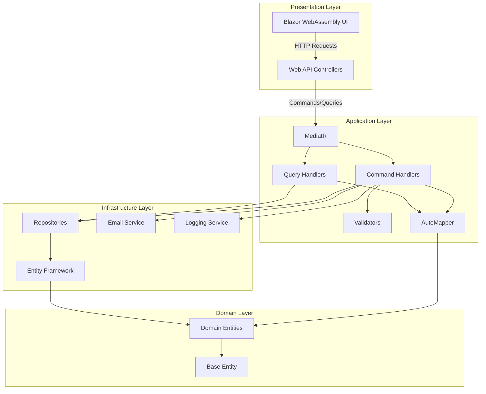
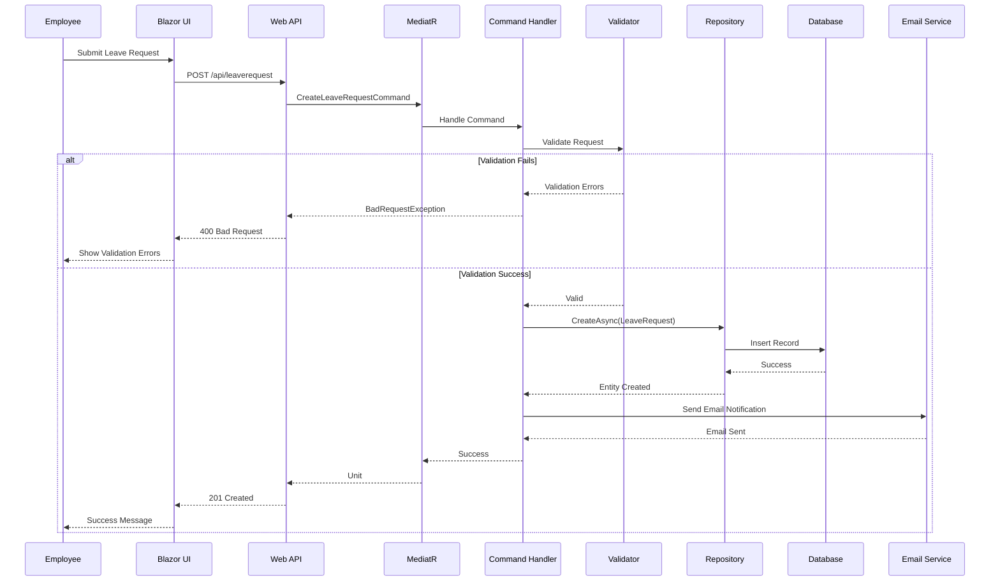
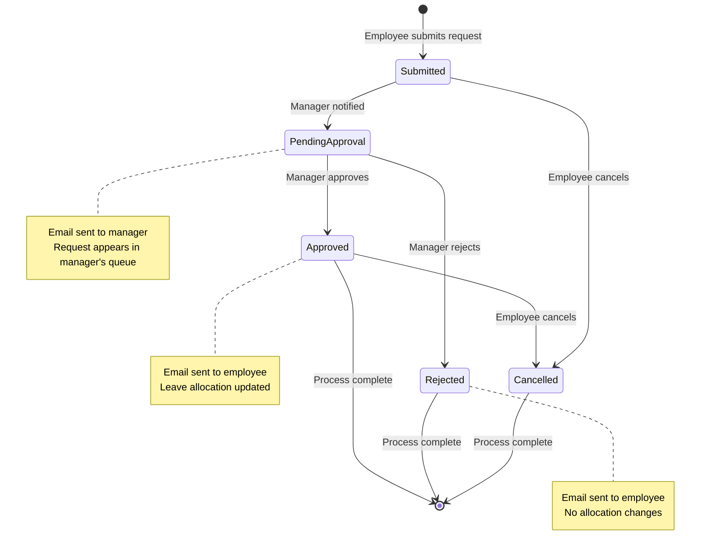
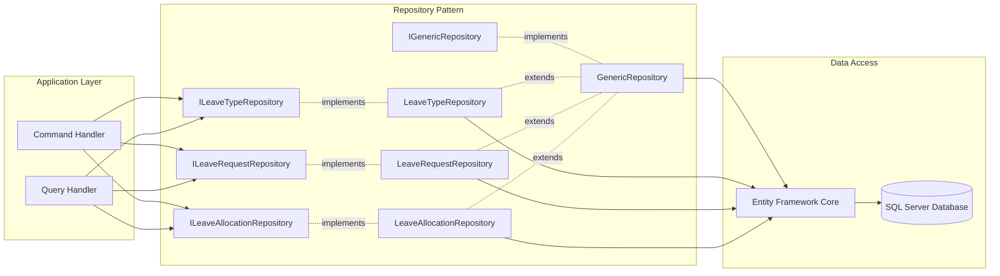
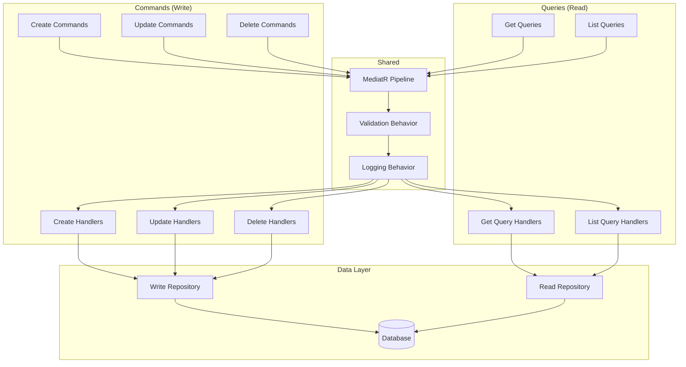
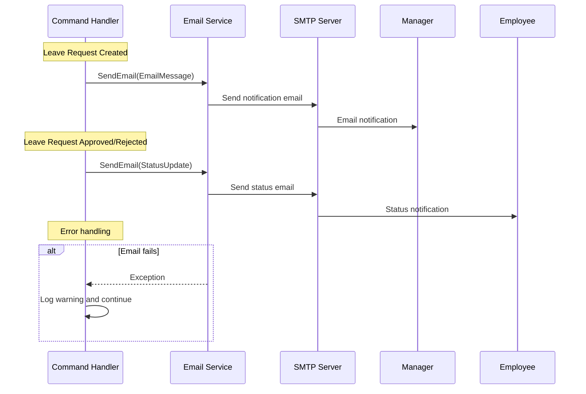
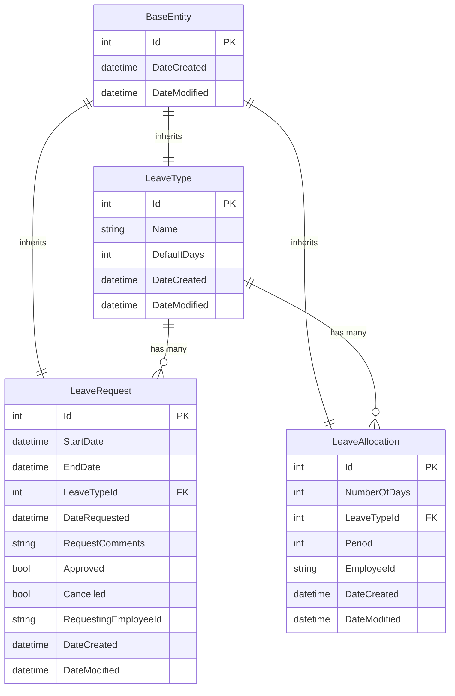
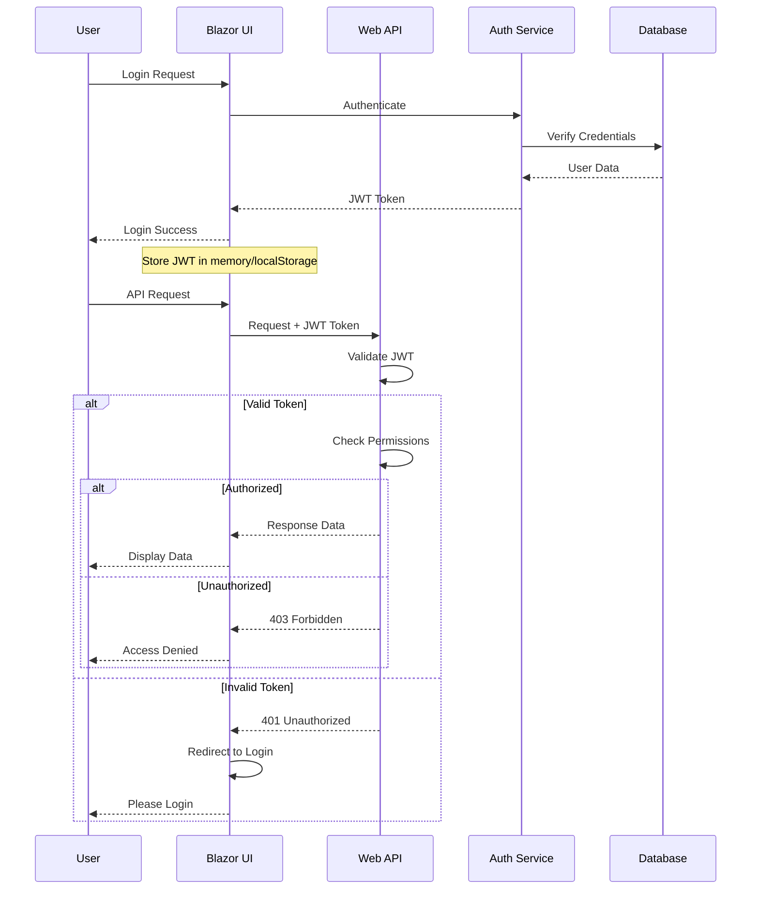
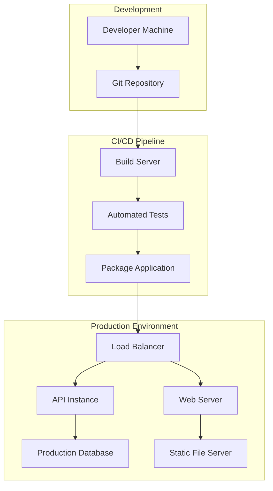
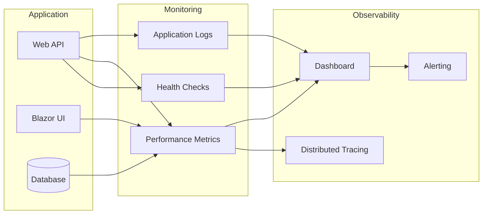

# HR Leave Management System - Technical Flow Diagrams

## System Architecture Flow



## Leave Request Processing Flow



## Leave Approval Workflow



## Data Access Pattern Flow



## CQRS Implementation Flow



## Email Notification Flow



## Entity Relationship Diagram



## Authentication & Authorization Flow (Future Implementation)



## Deployment Flow



## Performance Monitoring Flow



## Error Handling Flow

```mermaid
flowchart TD
    REQ[Incoming Request] --> MW[Exception Middleware]
    MW --> CTRL[Controller Action]
    CTRL --> MED[MediatR Handler]
    
    MED --> {Exception?}
    
    {Exception?} -->|ValidationException| VE[Validation Error]
    {Exception?} -->|NotFoundException| NF[Not Found Error]
    {Exception?} -->|BadRequestException| BR[Bad Request Error]
    {Exception?} -->|General Exception| GE[Internal Server Error]
    {Exception?} -->|No Exception| SUCCESS[Success Response]
    
    VE --> FORMAT[Format Error Response]
    NF --> FORMAT
    BR --> FORMAT
    GE --> FORMAT
    
    FORMAT --> LOG[Log Error]
    LOG --> RESPONSE[Return Error Response]
    
    SUCCESS --> RESPONSE[Return Success Response]
    
    RESPONSE --> CLIENT[Client Application]
```